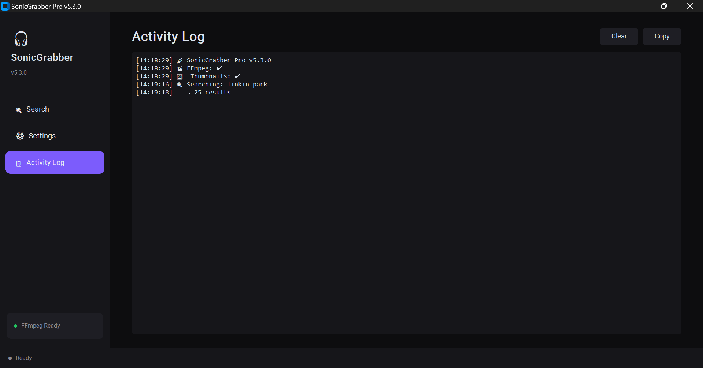
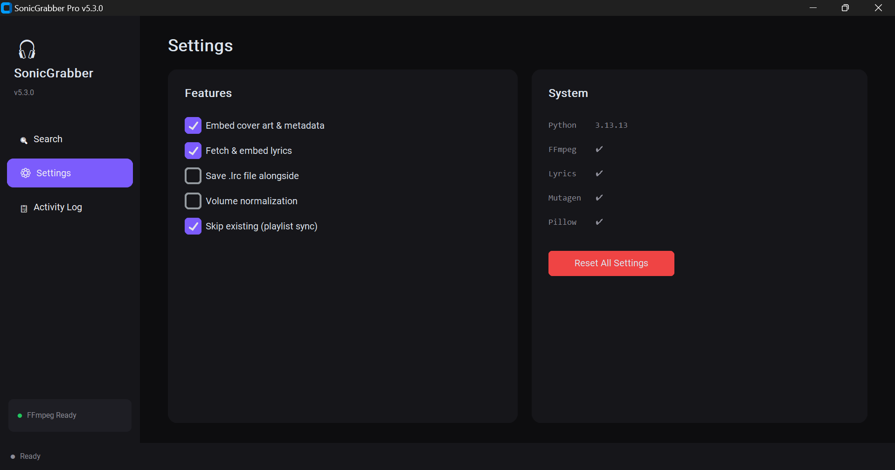
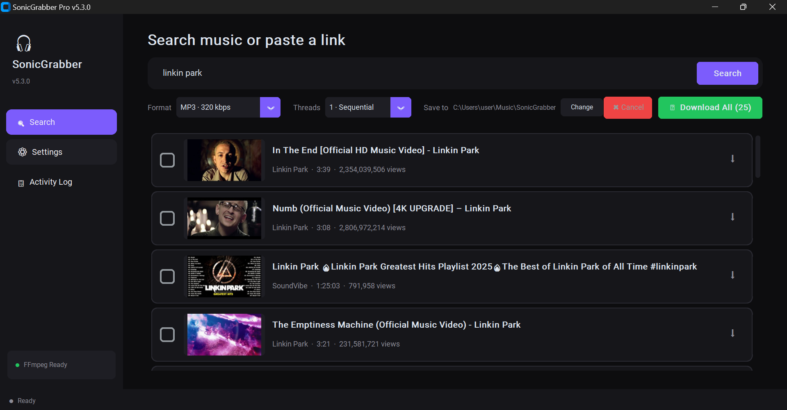

# 🎧 SonicGrabber Pro

**A modern desktop music downloader with integrated search, thumbnail previews, and playlist sync.**

Search for any song, artist, or playlist — or paste a direct link — and download high-quality audio with embedded cover art, metadata, and lyrics. Built with Python and CustomTkinter.

---

## ✨ Features

| Feature | Details |
|---|---|
| 🔍 **Integrated Search** | Search YouTube music directly from the app — no browser needed |
| 🖼️ **Thumbnail Previews** | Search results show actual thumbnails so you can identify the right track |
| 🔗 **URL Support** | Paste any YouTube, SoundCloud, or Bandcamp link to download instantly |
| 📁 **Playlist Sync** | Re-download a playlist and only **new tracks** are fetched — existing files are skipped |
| 🏷️ **Full Metadata** | Embeds cover art, title, artist, album into ID3v2.3 / Vorbis / MP4 tags |
| 🎤 **Lyrics** | Fetches synced lyrics from the web and embeds them into the audio file |
| 📝 **LRC Export** | Optionally saves a `.lrc` lyrics file alongside each track |
| 🔊 **Normalization** | Optional loudness normalization (EBU R128) |
| 🎞️ **Multi-format** | MP3 320kbps · FLAC Lossless · M4A AAC · Opus |
| ⚡ **Parallel Downloads** | 1, 3, or 5 concurrent download threads |
| 📱 **Phone Ready** | Clean folder structure + embedded tags = instant offline library on any music app |

---

## 📸 Screenshots

| Search | Results with Thumbnails | Downloading |
|---|---|---|
|  |  |  |

> *Add your screenshots to a `screenshots/` folder in the repo.*

---

## 🚀 Installation

### Prerequisites

- **Python 3.10+** — [python.org/downloads](https://www.python.org/downloads/)
- **FFmpeg** — required for audio conversion

```bash
# Install FFmpeg (Windows)
winget install Gyan.FFmpeg

# Install FFmpeg (macOS)
brew install ffmpeg

# Install FFmpeg (Linux)
sudo apt install ffmpeg